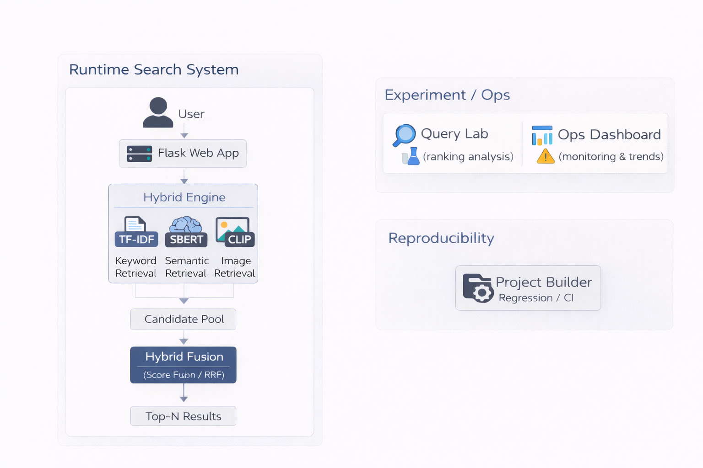
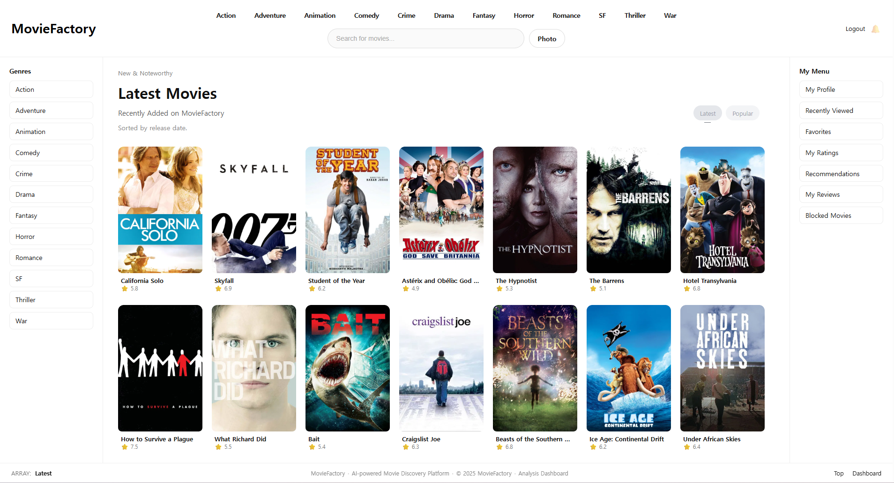
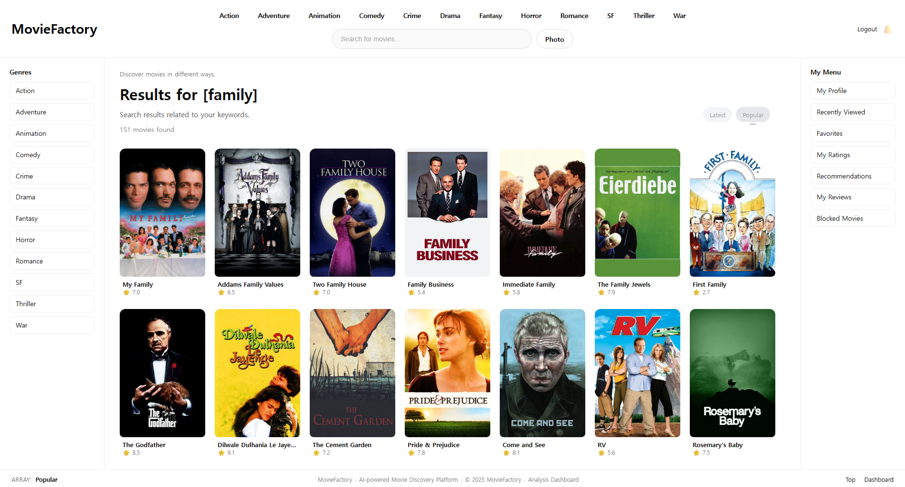
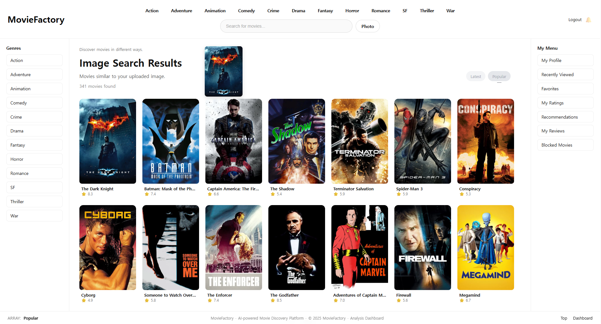
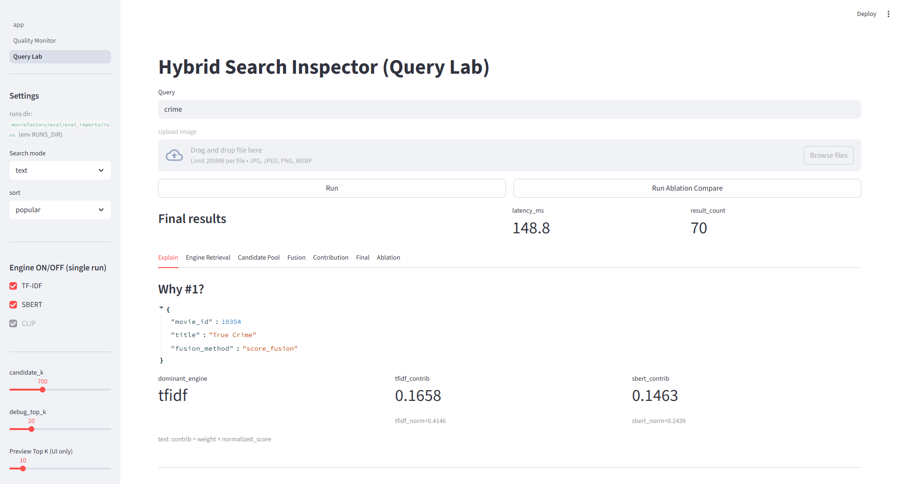
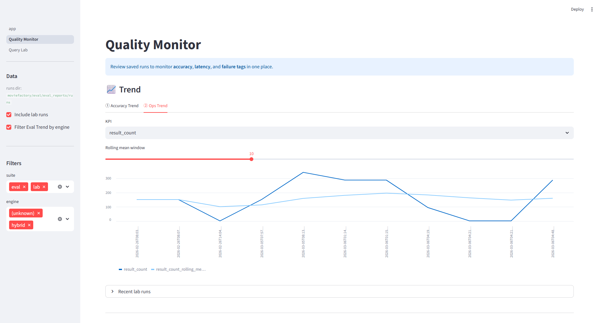

# 🎬 MovieFactory

**하이브리드 AI 영화 검색 & 검색 실험 플랫폼**

<p align="center">
  
</p>

Hybrid AI Movie Search + Ranking Analysis + Search Ops Monitoring

---

MovieFactory는 **텍스트 검색, 의미 기반 검색, 이미지 기반 검색을 결합한 Hybrid Retrieval 영화 검색 시스템**입니다.

단순한 검색 서비스 구현을 넘어서 **검색 랭킹 분석, 검색 실험, 운영 모니터링까지 가능한 실험 플랫폼 형태**로 설계되었습니다.

---

# 📑 목차

* [프로젝트 설계 목표](#-프로젝트-설계-목표)
* [Key Features](#-key-features)
* [System Architecture](#-system-architecture)
* [Demo Screens](#-demo-screens)
* [검색 실험 환경](#-검색-실험-환경)
* [기술 스택](#-기술-스택)
* [프로젝트 구조](#-프로젝트-구조)
* [프로젝트 핵심 포인트](#-프로젝트-핵심-포인트)

---

# 🎯 프로젝트 설계 목표

검색 시스템은 단순히 결과를 반환하는 기능을 넘어서 다음 문제를 해결해야 합니다.

* 서로 다른 검색 모델을 결합하는 **Hybrid Retrieval**
* 검색 결과가 왜 그렇게 정렬되었는지 설명하는 **Ranking Explainability**
* 검색 모델 성능을 비교할 수 있는 **Experiment Environment**
* 실제 서비스 품질을 관리하는 **Search Operations Monitoring**

MovieFactory는 이러한 문제를 해결하기 위해 다음과 같은 구조로 설계되었습니다.

---

# ✨ Key Features

### Hybrid Retrieval Engine

여러 검색 엔진을 결합하여 검색 품질을 향상시킵니다.

지원 엔진

* **TF-IDF** : 키워드 기반 검색
* **SBERT** : 의미 기반 임베딩 검색
* **CLIP** : 이미지 기반 유사 콘텐츠 검색

---

### Hybrid Ranking Fusion

여러 검색 결과를 결합하여 최종 랭킹을 생성합니다.

사용 방식

* Score Fusion
* Reciprocal Rank Fusion (RRF)

---

### Query Lab (검색 분석 도구)

검색 결과가 **왜 해당 순서로 랭킹되었는지 분석**할 수 있는 실험 환경입니다.

지원 기능

* Engine Retrieval 분석
* Candidate Pool 분석
* Hybrid Fusion 분석
* Engine Contribution 분석
* Ablation 실험

---

### Quality Monitor (Ops Dashboard)

검색 실험 결과와 운영 데이터를 모니터링합니다.

지원 기능

* 검색 품질 트렌드 분석
* latency 모니터링
* 실험 run 기록
* KPI 분석

---

### Reproducible Builder

프로젝트를 **한 번의 실행으로 재구성**할 수 있습니다.

```
python builder.py
```

Builder는 다음을 자동 구성합니다.

* 프로젝트 구조
* 데이터셋
* 캐시 환경
* 실행 스크립트

---

# 🧠 System Architecture

<p align="center">
  
</p>

검색 시스템 흐름

```
사용자 Query
      │
Flask Web Application
      │
Hybrid Retrieval
(TF-IDF / SBERT / CLIP)
      │
Candidate Pool 생성
      │
Hybrid Fusion
(Score Fusion / RRF)
      │
Top-N 검색 결과
```

분석 및 운영 도구

* Query Lab → 검색 랭킹 분석
* Quality Monitor → 검색 운영 모니터링

---

# 🖥 Demo Screens

## Home (서비스 메인 화면)

<p align="center">
  
</p>

메인 화면에서는 다음 기능을 제공합니다.

* 최신 영화 목록
* 장르 기반 탐색
* 검색 진입 화면

---

## Text Search (텍스트 검색)

<p align="center">
  
</p>

텍스트 검색은 **TF-IDF + SBERT Hybrid Retrieval** 기반으로 동작합니다.

예시 검색어

```
family
crime
animation
```

---

## Image Search (이미지 기반 검색)

<p align="center">
  
</p>

영화 포스터 이미지를 업로드하면 **CLIP 임베딩을 이용하여 유사한 영화**를 검색합니다.

검색 파이프라인

```
Image
 ↓
CLIP embedding
 ↓
CLIP retrieval
 ↓
Pseudo Query 생성
 ↓
SBERT retrieval
 ↓
RRF Fusion
```

---

## Query Lab (검색 분석 환경)

<p align="center">
  
</p>

검색 결과를 분석하는 실험 환경입니다.

분석 가능한 정보

* Engine Retrieval
* Candidate Pool
* Fusion 과정
* Engine Contribution
* Final Ranking

---

## Quality Monitor (검색 운영 대시보드)

<p align="center">
  
</p>

검색 품질과 실험 결과를 모니터링합니다.

주요 기능

* Accuracy Trend
* Ops Trend
* Experiment Run 기록
* KPI 분석

---

# 🧪 검색 실험 환경

MovieFactory는 검색 품질 개선을 위한 실험 환경을 제공합니다.

지원 기능

* query 기반 랭킹 분석
* 엔진별 성능 비교
* Ablation 실험
* latency 측정
* 실험 run 기록

실험 결과는 **Quality Monitor Dashboard**에서 확인할 수 있습니다.

---

# 🧱 기술 스택

### Backend

* Python
* Flask

### Retrieval

* TF-IDF
* SBERT
* CLIP

### ML / Embedding

* SentenceTransformers
* OpenCLIP

### Dashboard

* Streamlit

### Data Processing

* Pandas
* Numpy

---

# 📂 프로젝트 구조

```
moviefactory/

app/
    main.py
    search_api.py

engine/
    tfidf_engine.py
    sbert_engine.py
    clip_engine.py

eval/
    regression_check.py
    text_queries_intent.yaml

streamlit/
    quality_monitor.py
    query_lab.py

builder/
    builder.py

data/
    movie_clean_data_poster.csv
```

---

# 📊 프로젝트 핵심 포인트

MovieFactory는 단순 검색 서비스가 아니라 다음 영역을 통합적으로 다루는 프로젝트입니다.

* Hybrid Search System
* Ranking Explainability
* Search Experimentation
* Search Operations Monitoring
* Reproducible ML Engineering

즉 검색 시스템을 **개발 → 분석 → 실험 → 운영**까지 연결하는 구조로 설계되었습니다.

---

# 👤 Author

Search / CX Technology Portfolio Project

MovieFactory
